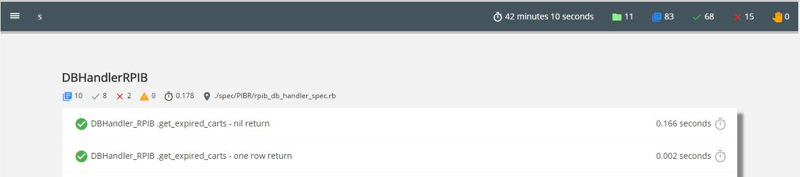
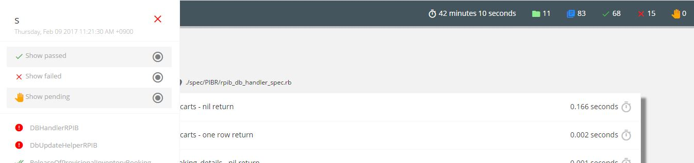

# rsformat

rsformat is built for viewing your rspec results in a better and more user friendly way. It converts the results into an HTML report.
This is completely configurable and gives your HTML report a much more personalised view.

### Dependencies

There are few dependencies for rsformat.

```
'json', '~> 2.0', '>= 2.0.3'
'rspec', '~> 3.4'
'rspec-core', '~> 3.4', '>= 3.4.4'

```

### Getting started

Installation

```
You can install rsformat ruby gem from [Ruby Gems](https://rubygems.org) by searching for rsformat.
or you can directly use gem install rsformat for the same. 

```

Help and other Options

```
rsformat has some inbuild options which you can use to configure and personalise the report. 


rsformat --help <for all the information you need on this gem>

rsformat init-help <for all the configuration you can do while initializing your project with rsformat>

rsformat init <walks you through the configuration steps for the project>

```

### How does it looks ?

Below are some of the images on how the final report may look like. 


---------------------------------------------------------------------------------------------------------------




### Authors

* **Shreyas Bande** - *Initial work* - [ssbande](https://github.com/ssbande)
